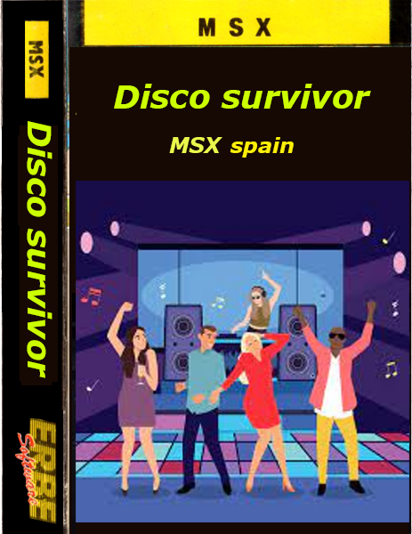

# Disco survivor

George debe llegar a los lugares de la discoteca:

En la 1 pantalla debe llegar al aseo antes de que explote.
En la 2 pantalla debe llegar a la barra del bar sin que el coronavirus lo contagie.
En la 3 pantalla debe de pedirle al dj que ponga otra canción
En la 4 una chica le ha pedido ir a los reservados

# Play online

https://msx-spain.github.io/disco-survivor/?disk=main.dsk

# Develop

Escribe en un cmd de windows make.bat

# Test sjasmplus + dezod debugger

Pincha aquí para ver como depurar en ensamblador:

<a href="docs/Como-depurar.md">Como depurar</a>