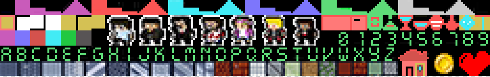

# Disco survivor

George debe llegar a los lugares de la discoteca para ello deberá de intentar no chocarse con nadie, cuidado con el coronavirus:

En la 1 pantalla debe llegar al aseo antes de que explote.

En la 2 pantalla debe llegar a la barra del bar sin que el coronavirus lo contagie.

En la 3 pantalla debe de pedirle al dj que ponga otra canción

En la 4 una chica le ha pedido ir a los reservados

# Play online

https://msx-spain.github.io/Disco-survivor/?disk=main.dsk&M=MSX2E

# Develop

Escribe en un cmd o terminal:

## Windows:

"make.bat" para compilar el proyecto MSX basic utilizando dir as disk

"make.bat dos" para compilar el proyecto MSX DOS utilizando dir as disk

"make.bat rom32" para compilar el proyecto ROM 32Kb utilizando un cartucho

## Unix:

"chmod +x make.sh" para dar permisos de ejecución

"./make.sh" para compilar

# Test sjasmplus + dezod debugger

Pincha aquí para ver como depurar en ensamblador:

<a href="docs/Como-depurar.md">Como depurar</a>

## Spriteset

## Tileset

Del 0 al 32 los de decoración.

del hacia delante los sólidos

## Screens /levels

Menu

<!---->

Level 1

<!--

-->

Level 2

<!--

-->

Level 3

<!--

-->

Level 4

<!--

-->

Level 5

<!--

-->

Level 6

<!--

-->

Final

<!---->